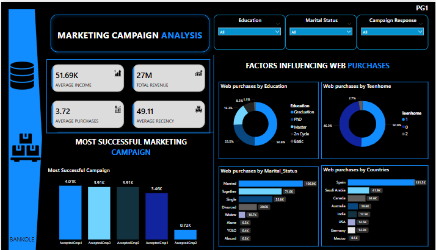
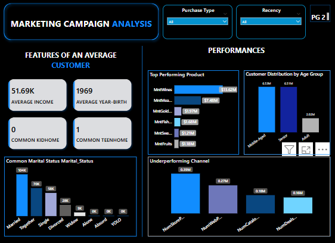

# E-commerce-Marketing-And-Sales-Performance-Dashboard-(PowerBI)-
This Power BI dashboard provides an in depth analysis of marketing campaigns, customer demographics, purchasing behavior, and also channel performance for an e-commerce marketing dataset. The goal is to help stakeholders understand which marketing strategies work, who their customers are, and how purchases vary across different channels.

---

### Project Overview
This project explores the **Marketing Campaign Dataset** of 2,240 customers from **Maven Marketing**. The aim is to analyze customer behavior, campaign effectiveness, and product/ channel performance to provide actionable insights for decision making.

---
### Objectives
- Identify missing values or Outliers and apply appropriate handling.
- Analyze customer profiles and purchasing behaviors.
- Determine the most successful marketing campaign
- Evaluate product and channel performance
- Profile the average customer and define age segments.

  ---
  ### Key KPIs on Dashboard
- Average Income
- Average purchase frequency
- Total Revenue
- Average Recency

---
### Tools Used
- Power Query:
    1. For Data Cleaning (Null Handling,Unpivoting,Conditional Colums, Data Types)
- Power BI
    1. For Data Transformation
    2. Data Modeling
    3. Data Visualization.
- DAX:
    1. For calculated fields(e.g., Age, Age Groups etc).
- Github
   1. For Documentation

  ---

  ### Additional Notes
- Used conditional column to convert campaign response into "Yes"/"No"

- Created Age Group column for better customer profiling

- Applied filters to remove unrealistic age values (above 90)

  ---
  ### Dashboard
  

  

  ---
  ### Key Insights
- **Customer Profile**: Most customers are middle-aged adults with higher education(Graduated Degree) and are married. This suggests the target audience is mature and potentially financially stable.

- **Channel Performance**: Store purchases significantly outperform web and catalog channels, indicating customers prefer in-person shopping experiences.

- **Product Spending**: Wines are the most purchased product category, followed by meat and gold products, pointing to high-end product interest.

- **Campaign Effectiveness**: Campaign 4 has the highest response rate, making it the most effective among all campaigns.

- **Web Purchases**: Income, education level, and recency of engagement appear to be related to the number of web purchases, suggesting digital marketing could be better tailored to higher-income, educated customers.

---
### Recommendations

 🏬 1. **Strengthen Digital Channels**

Store purchases are currently the most preferred channel, showing strong customer engagement offline. However, online and catalog purchases are significantly underperforming. This suggests a need to improve the user experience on digital platforms, consider website optimization, targeted social media ads, and exclusive online deals to drive growth.

 📢 2. **Leverage Campaign 4’s Success**

Among all campaigns, **Campaign 4 performed the best**. This suggests that the content, audience targeting, or timing resonated well with customers. Analyzing this campaign further can help replicate its success such as adapting its strategies across less successful campaigns or scaling it for future launches.

👥 3. **Personalize by Customer Demographics**

Customer behavior varies across age groups, marital status, and education. For instance, middle-aged married customers made more frequent purchases. Tailoring marketing messages and product offers to these segments can increase engagement and loyalty. Consider segmentation in future campaigns.

 🍷 4. **Promote Best-Performing Products**

Wines are the top performing product category in terms of revenue. This product can be used in **bundled promotions, gift sets, or loyalty rewards**. Meanwhile, underperforming products like sweets and fruits may benefit from seasonal offers, health themed branding, or limited edition variants.

 🔁 5. **Re-Engage Inactive Customers**

The recency metric indicates that some customers haven’t interacted with the brand in a while. This is a clear opportunity for **re-engagement campaigns**, “We Miss You” emails, special discounts, or win back offers can help revive their interest and retain their loyalty.

---

### Conclusion

This analysis provided valuable insights into customer behavior and the effectiveness of marketing efforts. It revealed that store purchases dominate as the preferred channel, while online and catalog platforms require strategic improvement. Among all campaigns, Campaign 4 stood out for its high performance, suggesting a successful approach that can be studied and replicated.

The average customer tends to be middle-aged, married, and has a moderate level of income, pointing towards clear segments for targeted marketing. Additionally, wines emerged as the most purchased product, offering opportunities for product bundling and promotion.

By combining these findings, Maven Marketing can enhance campaign targeting, improve underperforming sales channels, and better align product promotions with customer preferences. ultimately leading to improved customer engagement and business performance.

      
